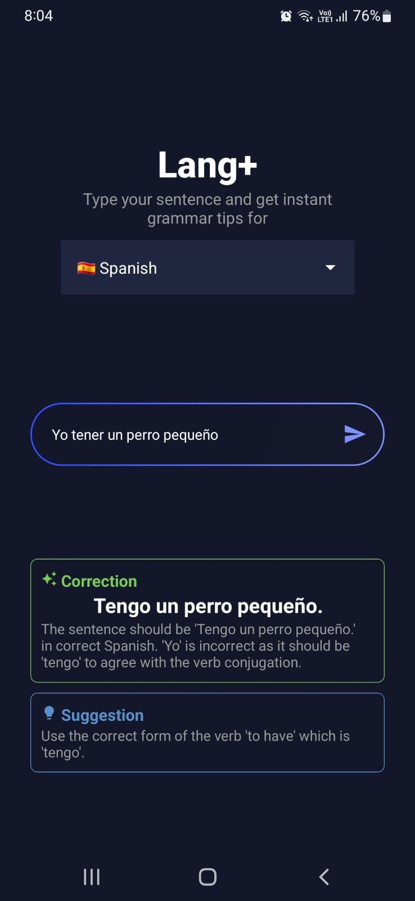
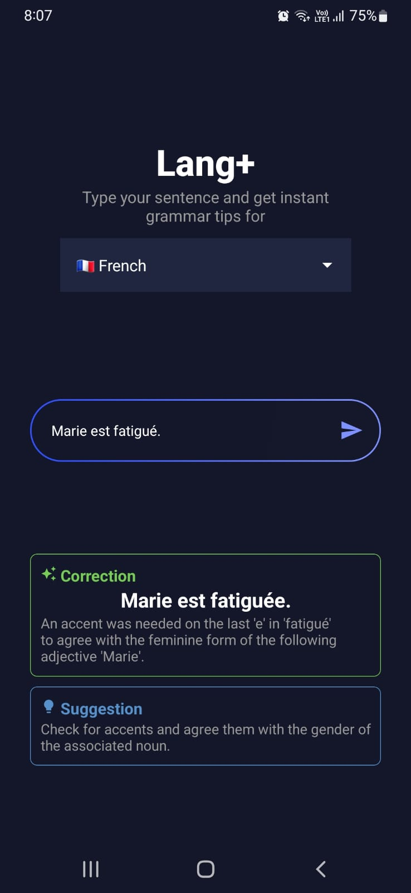

# Multilingual Practice App (LangPlus)

A simple language practice app built using **React Native**. Users can enter sentences in supported languages and receive grammar-corrected versions using an AI backend.

## Features

- Grammar correction for multiple languages.
- Clean and minimal UI.

## Screenshots

